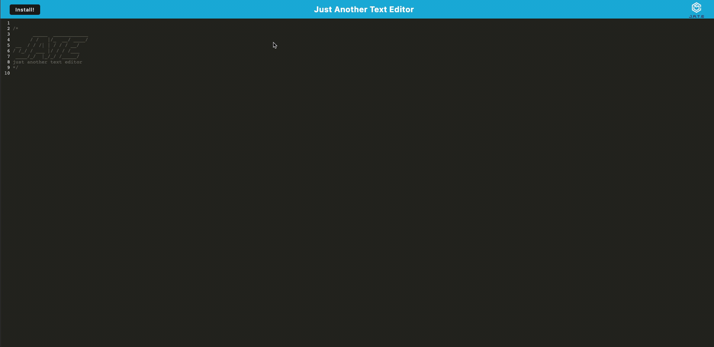

# Just Another Text Editor (pwa homework)

## Description

Just Another Text Editor is a simple text editor that can run in the browser without an internet connection. It is a PWA (Progressive Web Application). JATE will store data in an indexedDB database.

[Deployed link](https://just-another-text-editor19.herokuapp.com)

## Table of Contents

- [Installation](#installation)
- [Usage](#usage)
- [Contact](#contact)

## Installation

You can either visit the public URL or you can clone the repo, and run ``npm install` to install the necessary dependencies

## Usage

The following brief video demonstrates how the app functions:

Image of the manifest.json file:

Image of the registered service worker:

Image of the indexedDB storage:

## Contact

You can reach me at any time at [gdjewell@gmail.com](mailto:gdjewell@gmail.com) or on Github with [@gdjewell](https://github.com/gdjewell).
